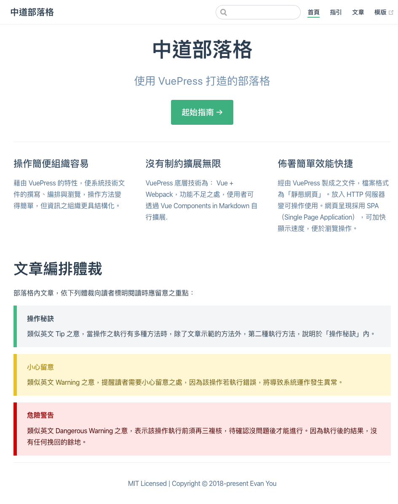

# VuePress 部落格模版

採用 VuePress 之部落格模版，讓人快速上手，完成個人部落格建置。

## 立即啟用

> 使用 VuePress ，您需要 Node.js ，至少 8.0 以上之版本。

請先確認您的電腦已安裝符合上述需求之 Node.js 。待確認無誤後，再依下列提示輸入指令，即可在個人端之電腦，啟用本模版所示範之部落格。

1. 以 Global 方式安裝 VuePress 套件。
    ```shell
    npm install -g vuepress 
    ```

    【註】： yarn 使用者請改用以下指令：

    ```shell script
    yarn global add vuepress 
    ```

2. 自 GitHub 下載本模版相關檔案。
    ```shell
    git clone git@github.com:AlanJui/vuepress-blog.git
    cd vuepress-blog
    ```

3. 安裝 Node.js 相關組件。
    ```shell
    npm install --save
    ```
    
    【註】： yarn 使用者請改用以下指令：
    
    ```shell script
    yarn install --save
    ```

4. 啟動 VuePress 編輯模式。
    ```shell
    npm run dev
    ```
    
    【註】： yarn 使用者請改用以下指令：
    
    ```shell script
    yarn dev 
    ```

5. 啟動 Web 瀏覽器，輸入下述網址後，應可看到如下所示之網頁內容。

    ```shell script
    http://localhost:8080/
    ```


